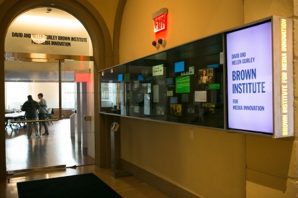

Gifted and Talented
===================
The Brown Institute's toolchain for managing our mediawall powered by a bunch of [Brightsign HD1020](https://web.archive.org/web/20140326220923/http://brightsign.biz/digital-signage-products/hd-product-line/hd1020/) units.

## Status
Still hypothetical and aspirational when it comes to code

# Background
In the entryway to [The Brown Institute's](http://brown.columbia.edu) at Columbia Journalism School, there are two walls covered with 50 displays of varying sizes behind a pane of two-way glass. It's meant to show past events, advertise upcoming activities, and remarkable work that's meant to inspire students and visitors. For a media wall, it's beautiful. It's also built on top of of a rock-solid technical platform that _juuuust barely_ predates that moment where HTML5 was running on every embedded device. But they've yet to reach their full potential: it's hard to update content and we've never been able to make the screens change content in a coordinated way.

# Setup Instructions
Brown Institute Mediawall specific setup is [described in the mediawall folder](mediawall/README.md). This supercedes the PLAN section (below).

# Plan
_**WARNING**: This doesn't work yet. There's no code. No tests. No progress. Just notes and theory._

Project architecture is split into two parts:
1. a content pusher, which will move the individual parts of each "Show" (a video customized for each display's size and orientation of the precise same number of frames) to each of the respective Brightsign units.
2. A show builder, which will allow a user to edit together the contents of each screen (from images or videos) simultaneously, and render each display's video individually.

This plan assumes:
* We can use BrightSign BrightAuthor to create a "show" for each player tailored to its dimensions comprised of a video (based on its filename)
* That show's simultaneous playback can be synchronized using a master/slave setup and that Enhanced Synchronization will keep the video playback frame-by-frame accurate after looping the videos
* We can replace the videos on the server on a nightly basis and each BrightSign will pick up and begin running the latest content, still in sync

This plan uses videos of uniform length rather than composing each show of many individual images and timings. We're doing this to avoid writing a whole bunch of Brightscript.

Detailed description is laid out further in the [Planning Document](plan.md).
